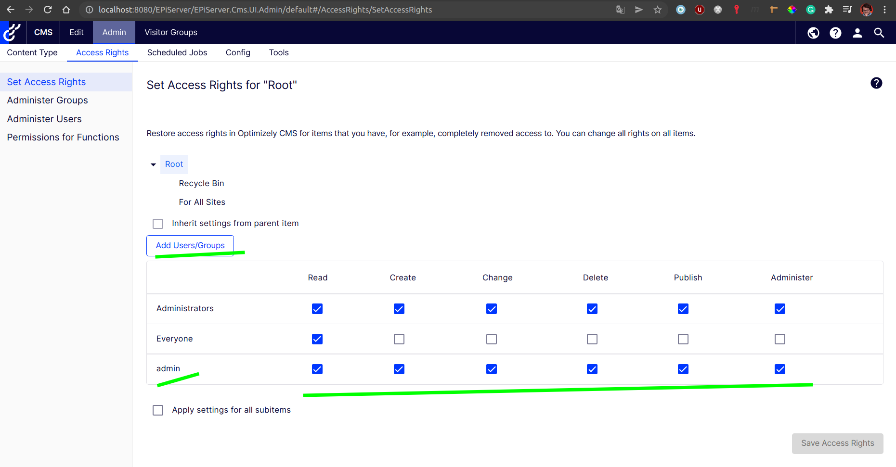

# Notes on Optimizely CMS Project creation

## Create a project

1. Install required tools and sdks
    1. Templates: `dotnet new -i EPiServer.Net.Templates --nuget-source https://nuget.optimizely.com/feed/packages.svc/ --force`
    1. Cli tools: `dotnet tool install EPiServer.Net.Cli --global --add-source https://nuget.optimizely.com/feed/packages.svc/`
    1. Check license, but for localhost it was free as on `2022/01/31`

1. Install sql server and dotnet sdk 5

1. Create a project:

```shell
dotnet new epicmsempty --name projectName
cd projectname
# or -E for integrated security
dotnet-episerver create-cms-database ProjectName.csproj -S "localhost, 1433" -U sa -P SuperAdmin1!
dotnet-episerver add-admin-user ProjectName.csproj -u admin -p "Test@123" -e admi@noemail.nocom -c EPiServerDB
```

> **Important**: don't confuse connection string name here at user creation, Commerce addon (or any other) has it's own database and conenction string

## First Usage

After you logged in as admin, you are not really admin, just a WebAdmin.

WebAdmin and Administrators are different groups in the system and they are not connected at all (for whatever reason).

So you may not be able to add a new page under the Root.

### Fix

Navigate to tab Admin -> sub-tab Access Rights -> category Set Access Rights.

Select Root in the tree and add you admin user to the table of permissions and assign all options.


